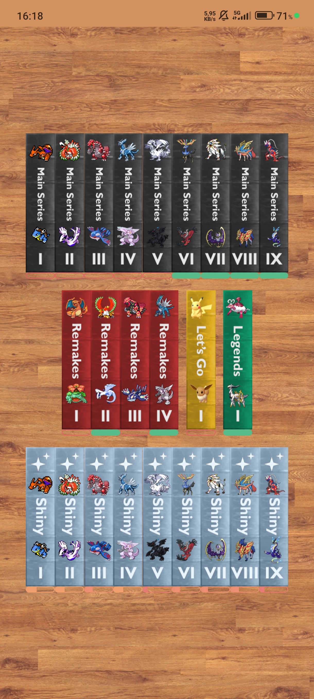
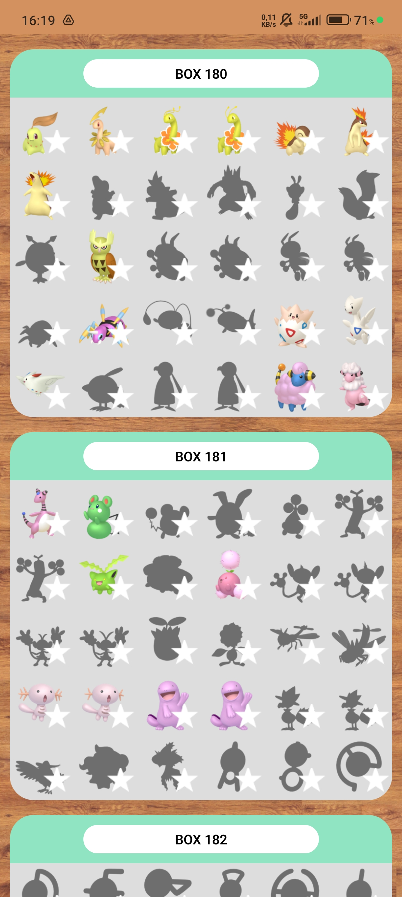

# Alex Silva Portfolio
## About me
I'm a *Spanish student* of **computer science**, with a strong passion for sports, particularly **pole vaulting**. This unique combination of interests allows me to balance my academic **pursuits** with my athletic **dedication**.

Currently, I work at a *media agency*, where I provide **IT support** and contribute as a **web developer**. In this role, I apply my technical skills to *solve problems*, *develop websites*, and ensure that our digital projects run **smoothly**.
## Projects
- ### Ultimate Dex Tracker
  A personal app I developed with React Native to track every Pokémon's game Pokédex.
  |||
  |:-:|:-:|
  |||

- ### Business Facturation Spreadsheets
- ### Club Atletisme Atlas Database

## Skills
## Contact
