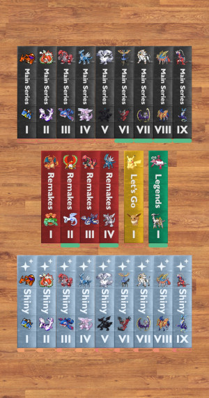

# Alex Silva Portfolio
## About me
I'm a *Spanish student* of **computer science**, with a strong passion for sports, particularly **pole vaulting**. This unique combination of interests allows me to balance my academic **pursuits** with my athletic **dedication**.

Currently, I work at a *media agency*, where I provide **IT support** and contribute as a **web developer**. In this role, I apply my technical skills to *solve problems*, *develop websites*, and ensure that our digital projects run **smoothly**.

> Never surrender
## Projects
- ### Ultimate Dex Tracker
  A personal app I developed with React Native to track every Pokémon's game Pokédex.
  |||
  |:-:|:-:|
  |||

- ### Business Facturation Spreadsheets
  I worked in the creation of a couple spreadsheets for business. These are being used currently to speed up the facturation process.
- ### Club Atletisme Atlas Database
  A work in progress app developed in Next.JS which will be used by trainers from the Club Atletisme Atlas to store marks, records and being an information source to the athleets. Currently, the version manager used is a [GitHub repository](https://github.com/AsGamer1/datatlas2). There's also a deployed version on [this website](https://portal.atletismeatlas.es), but the public information there is almost non-existent.
  
  ```js
  "use server";

    import { signOut } from "@/auth";
    import { DEFAULT_LOGOUT_REDIRECT } from "@/routes";

    export async function logout() {
    await signOut({redirectTo: DEFAULT_LOGOUT_REDIRECT})
    }
  ```
## Skills
|Skill|Proficiency|Experience|
|:-:|:-:|:-:|
|Javascript Development|High Intermediate|3 years (personal projects)|
|Critical Thinking|Intermediate|4 months (academic projects)|
|Teamwork|Advanced|10+ years (sports team, group assignments)

## Contact
- [x] [Email](mailto:asilvaguerrero@cifpfbmoll.eu)  
- [ ] Phone  
- [ ] Linkedin